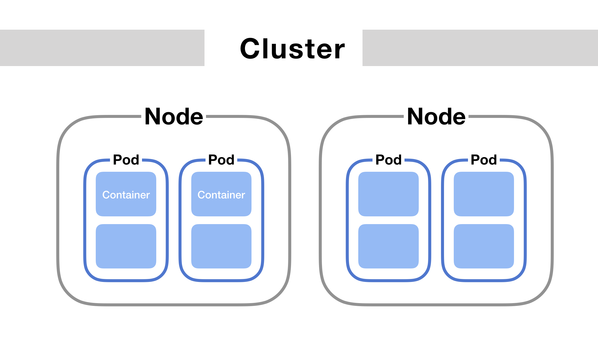
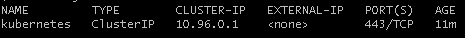
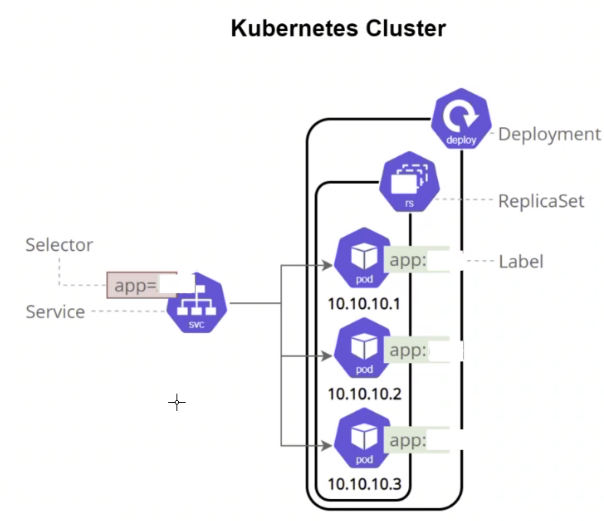
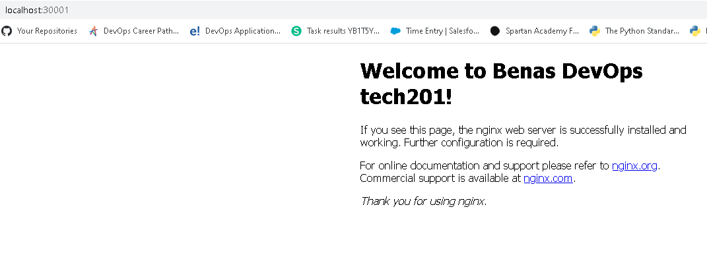
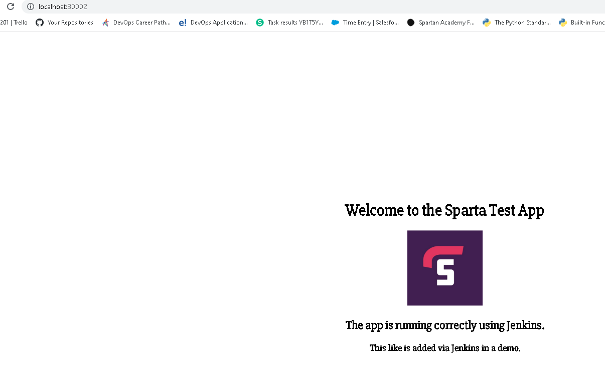

## What is Kubernetes
* Kubernetes, also known as K8s, is an open-source system for automating deployment, scaling, and management of containerized applications
* It groups containers that make up an application into logical units for easy management and discovery
## Kubernetes benefits
* **Automated Operations** -> Kubernetes has built-in commands to handle a lot of the heavy lifting that goes into application management, allowing you to automate day-to-day operations. You can make sure applications are always running the way you intended them to run
* **Infrastructure Abstraction** -> When you install Kubernetes, it handles the compute, networking, and storage on behalf of your workloads. This allows developers to focus on applications and not worry about the underlying environment
* **Service Health Monitoring** -> Kubernetes continuously runs health checks against your services, restarting containers that fail, or have stalled, and only making available services to users when it has confirmed they are running
## Kubernetes services
* `Automated rollouts and rollbacks` -> Kubernetes progressively rolls out changes to your application or its configuration, while monitoring application health to ensure it doesn't kill all your instances at the same time. If something goes wrong, Kubernetes will rollback the change for you. Take advantage of a growing ecosystem of deployment solutions
* `Service discovery and load balancing` -> No need to modify your application to use an unfamiliar service discovery mechanism. Kubernetes gives Pods their own IP addresses and a single DNS name for a set of Pods, and can load-balance across them
* `Storage orchestration` -> Automatically mount the storage system of your choice, whether from local storage, a public cloud provider such as AWS or GCP, or a network storage system such as NFS, iSCSI, Ceph, Cinder
* `Self-healing` -> Restarts containers that fail, replaces and reschedules containers when nodes die, kills containers that don't respond to your user-defined health check, and doesn't advertise them to clients until they are ready to serve
* `Secret and configuration management` -> Deploy and update secrets and application configuration without rebuilding your image and without exposing secrets in your stack configuration
* `Automatic bin packing` -> Automatically places containers based on their resource requirements and other constraints, while not sacrificing availability. Mix critical and best-effort workloads in order to drive up utilization and save even more resources
* `Batch execution` -> In addition to services, Kubernetes can manage your batch and CI workloads, replacing containers that fail, if desired
* `Horizontal scaling` -> Scale your application up and down with a simple command, with a UI, or automatically based on CPU usage
* `IPv4/IPv6 dual-stack` -> Allocation of IPv4 and IPv6 addresses to Pods and Services
* `Designed for extensibility` -> Add features to your Kubernetes cluster without changing upstream source code
## Kubernetes objects
Kubernetes objects are persistent entities in the Kubernetes system. Kubernetes uses these entities to represent the state of your cluster. Specifically, they can describe:
* What containerized applications are running (and on which nodes)
* The resources available to those applications
* The policies around how those applications behave, such as restart policies, upgrades, and fault-tolerance
* A Kubernetes object is a "record of intent"--once you create the object, the Kubernetes system will constantly work to ensure that object exists
* By creating an object, you're effectively telling the Kubernetes system what you want your cluster's workload to look like; this is your cluster's desired state
* Objects are created, modified and deleted using `Kubernetes APIs`
## Kubernetes architecture -> Clusters
* `Kubernetes cluster` -> A set of nodes that run containerized applications
* Kubernetes clusters have master nodes/control panels and worker nodes
* `Kubernetes node` -> A worker machine that runs Kubernetes workloads. Can be physical or virtual
* `Kubernetes workload` -> An application running on Kubernetes. Workloads are run inside `pods`
* `Kubernetes pod` -> A set of running containers in a cluster
* `Image registry` -> Where container images are kept. Transferred to nodes by `control planes` for execution within pods.
* Overal structure, from the inside out -> Workload -> Container -> Pod -> Node -> Cluster
## Kubernetes architecture -> Control plane
A `kubernetes control plane` is used to control a `kubernetes cluster`. Below are the componenets:
* `kube-apiserver` -> Exposes the `kubernetes api`. External communications from command line interface passthrough the `kube-apiserve`. All control plane to node communication passes through `kube-apiserver`.
* 



## Setting up a K8 cluster on docker desktop
1) Open docker desktop
2) Click on the cogwheel in the top right
3) Click on kubernetes
4) Tick the enable box
5) Both docker and kubernetes should be green in the bottom left
6) If required, restart your machine
7) Once both docker and kubernetes are green, open a gitbash terminal as an admin
8) Check whether everything is working by running the following command: 
```
kubectl get service
```
9) If everything is working, you should see output similar to the following:




## Kubectl commands
```
Basic Commands (Beginner):
  create          Create a resource from a file or from stdin
  expose          Take a replication controller, service, deployment or pod and expose it as a new Kubernetes service
  run             Run a particular image on the cluster
  set             Set specific features on objects

Basic Commands (Intermediate):
  explain         Get documentation for a resource
  get             Display one or many resources
  edit            Edit a resource on the server
  delete          Delete resources by file names, stdin, resources and names, or by resources and label selector

Deploy Commands:
  rollout         Manage the rollout of a resource
  scale           Set a new size for a deployment, replica set, or replication controller
  autoscale       Auto-scale a deployment, replica set, stateful set, or replication controller

Cluster Management Commands:
  certificate     Modify certificate resources.
  cluster-info    Display cluster information
  top             Display resource (CPU/memory) usage
  cordon          Mark node as unschedulable
  uncordon        Mark node as schedulable
  drain           Drain node in preparation for maintenance
  taint           Update the taints on one or more nodes

Troubleshooting and Debugging Commands:
  describe        Show details of a specific resource or group of resources
  logs            Print the logs for a container in a pod
  attach          Attach to a running container
  exec            Execute a command in a container
  port-forward    Forward one or more local ports to a pod
  proxy           Run a proxy to the Kubernetes API server
  cp              Copy files and directories to and from containers
  auth            Inspect authorization
  debug           Create debugging sessions for troubleshooting workloads and nodes

Advanced Commands:
  diff            Diff the live version against a would-be applied version
  apply           Apply a configuration to a resource by file name or stdin
  patch           Update fields of a resource
  replace         Replace a resource by file name or stdin
  wait            Experimental: Wait for a specific condition on one or many resources
  kustomize       Build a kustomization target from a directory or URL.

Settings Commands:
  label           Update the labels on a resource
  annotate        Update the annotations on a resource
  completion      Output shell completion code for the specified shell (bash, zsh, fish, or powershell)

Other Commands:
  alpha           Commands for features in alpha
  api-resources   Print the supported API resources on the server
  api-versions    Print the supported API versions on the server, in the form of "group/version"
  config          Modify kubeconfig files
  plugin          Provides utilities for interacting with plugins
  version         Print the client and server version information

Usage:
  kubectl [flags] [options]

Use "kubectl <command> --help" for more information about a given command.
Use "kubectl options" for a list of global command-line options (applies to all commands)
```
## Kubernetes
* Cluster can be set up locally or globally -> where k8 commands are run
* Clusters use apis on top of docker apis
* K8 uses yml
* Controller manages everything inside cluster
* Can run 2 containers in a pod, best to run 1
* 2 types of clusters available  -> multi-node(ec2 instances) and single node
* Single node is dev environment and test -> make with Minikube
* Multi-node is production
* K8 pods, services, deployment, name, space, cluster service, NodePort, LB services, replica sets
* K8 benefits: Self Healing, autoscaling, load balancing, automated roll backs
* Each service in a cluster is a microservice
* Each pod has its own ip
* `kubectl` communicate with cluster
* Check if server is running: ` kubectl get service`
* Open Docker desktop
* Make sure docker and K8 is running
* Enable kubernetes
* Apply and restart
* `kubectl` key word to use kubernetes command line
* `kubectl get service` -> shows what services are running on kubernetes
* `kubectl get svc` -> does the same thing as service
* `kubectl create -f filename.yml` -> run a script and create a deployment based of the script
* `f` flag specifies to look for a file, the name of which you specify next where it says `filename.yml`
* `kubectl get deploy` -> show deployment
* `kubectl get pods` -> shows running pods
* `kubectl get all` -> show everything running in a cluster
* `kubectl edit deploy deployment-name` -> edit a deployment without shutting it down -> no down time for customers
## Troubleshooting
* `kubectl describe pod
## Creating a kubernetes deployment for custom nginx image
1) Create a `nginx-deploy.yml` file
2) Inside the file, enter the following:
```
apiVersion: apps/v1 # Which api to use for deployment
kind: Deployment
metadata:
  name: nginx-deployment
spec:
  selector:
    matchLabels:
      app: nginx
  replicas: 3
  template:
    metadata:
      labels: 
        app: nginx
    spec:
      containers:
      - name: nginx
        image: benasj/tech201-nginx
        ports:
        - containerPort: 80
```
* Under `image`, use your own nginx image
3) Build the deployment:
```
kubectl create -f nginx-deployment.yml
```
## Creating an nginx service to make it accessable on the browser



1) Create a `nginx-service.yml` file
2) Inside the file, enter the following:
```
apiVersion: v1 # Select the type of API version and type of service/object
kind: Service
metadata:
  name: nginx-svc
  namespace: default

spec: 
  ports:
  - nodePort: 30001 #range is 30000-32768
    port: 80

    targetPort: 80

  selector:
    app: nginx # this label connects this service to deployment

  type: NodePort # also use LoadBalancer - for local use cluster IP
```
3) Build the service:
```
kubectl create -f nginx-service.yml
```
* Your edited nginx page should now be visible on the browser on port 30001: `localhost:30001`



## Creating a kubernetes deployment for the Sparta app
1) Create a `node-deploy.yml` file
2) Inside the file, enter the following:
```
apiVersion: apps/v1 # Which api to use for deployment
kind: Deployment
metadata:
  name: app-deployment
spec:
  selector:
    matchLabels:
      app: node-app
  replicas: 3
  template:
    metadata:
      labels: 
        app: node-app
    spec:
      containers:
      - name: node-app
        image: benasj/app:v3
        ports:
        - containerPort: 3000
```
3) Build the deployment:
```
kubectl create -f node-deploy.yml
```
## Create a service to make Sparta app accessible on the browser
1) Create a `node-service.yml` file
2) Inside the file, enter the following:
```
apiVersion: v1 # Select the type of API version and type of service/object
kind: Service
metadata:
  name: app-svc
  namespace: default

spec: 
  ports:
  - nodePort: 30002 #range is 30000-32768
    port: 3000

    targetPort: 3000

  selector:
    app: node-app # this label connects this service to deployment

  type: NodePort # also use LoadBalancer - for local use cluster IP
```
3) Build the service:
```
kubectl create -f node-service.yml
```
* The app should now be visible in your browser on: `localhost:30002`:



## Useful commands
1) `kubectl create -f filename.yml` -> Creates a microservice according to the specified script
2) `kubectl get deploy` -> Shows all running microservices of `deployment` type
3) `kubectl get services` -> Shows all running microservices of `services` type
4) `kubectl get pods` -> Shows all running pods
5) `kubectl get all` -> Shows everything thats running in the cluster
6) `kubectl delete service name` (the name specifiec in the creation script) -> Delete a specified service mircroservice
7) `kubectl delete deploy name` (the name specified in the creation script) -> Delete a specified deployment microservice
8) `kubectl get pods` -> Shows all running pods
9) `kubectl edit deploy deploy.yml` -> Allows you to edit a deployment script without downtime
10) `kubectl edit service service.yml` -> Allows you to edit a service script without downtime


